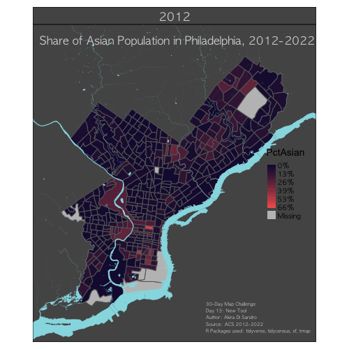

```{r r-setup, results='hide', echo = F, eval = T, warning = F, message = F}
knitr::opts_chunk$set(echo = T, eval = T, warning = F, message = F)

# set working directory
setwd("~/Documents/MUSA/Fall24/MUSA6310_Communication/30DayMappingChallenge2024/scripts/")

# load all packages
library(tidyverse)
library(tidycensus)
library(sf)
library(ggplot2)
library(ggtext)
library(glue)
library(overturemapsr)
library(tigris)
library(rdeck)
library(htmlwidgets)
library(arrow)
library(maps)
library(ggrepel)
library(flightplot)
library(biscale)
library(stringr)
library(cowplot)
library(rnaturalearth)
library(rnaturalearthdata)
library(tmap)

# read in API
census_api_key("f2855a6037284cb9cbed55e96e6b99be17ee05c6", overwrite = TRUE, install = T)

# mapbox API
options(rdeck.mapbox_access_token = "pk.eyJ1IjoiY2hpYmlha2kiLCJhIjoiY20xODh2NTNqMTBvaDJqb2ptbjM4ZGViayJ9.un9M1_-S6kI8M0ktqZLz_Q")

```


# Map 1

## Day 2 -- Lines: Philly Bike Lanes

I decided to simplify the categories of Philadelphia's streets that were available in the dataset to 4 categories: <span style="color: #DCCA2CFF;">**bike friendly**</span>, <span style="color: #FF7F50;">**shared**</span>, <span style="color: #0E84B4FF;">**bike lanes**</span>, and <span style="color: #58A449FF;">**buffered bike lanes**</span>.

```{r map1_data, results='hide'}
# philly crs
crs_philly <- 'EPSG:2272' # EPSG:2272 - NAD83 / Pennsylvania South (ftUS)

bikes <- st_read("../data/day02_data/PhiladelphiaBikeNetwork_SupportingDatasets201209/BikeNetwork_SupportingDatasets201209/PhiladelphiaBikeConnectorStreets201204.shp")
  
# source: https://opendataphilly.org/datasets/hydrology/
hydro <- st_read("https://services.arcgis.com/fLeGjb7u4uXqeF9q/arcgis/rest/services/Hydrographic_Features_Poly/FeatureServer/1/query?outFields=*&where=1%3D1&f=geojson") %>% 
  st_transform(crs = crs_philly)

# loading geometries of counties surrounding philly for basemap
nj_tracts <- get_acs(geography = "county",
                     variables = "B01001_001",
                     year = 2022,
                     state = 34,
                     county = c(5, 7, 15),
                     geometry = T) %>% 
  st_transform(crs = crs_philly)

pa_tracts <- get_acs(geography = "county",
                     variables = "B01001_001",
                     year = 2022,
                     state = 42,
                     county = c(17, 45, 91, 101),
                     geometry = T) %>% 
  st_transform(crs = crs_philly)

bikes_simplified <- bikes %>% 
  mutate(friendly = case_when(RecFacil %in% c("Bike Friendly Street", "Climbing Lane", "Cycletrack", "Contraflow") ~ "Bike Friendly Street",
                              RecFacil == "Buffered Bike Lane" ~ "Buffered Bike Lane",
                              grepl("Shared", RecFacil) ~ "Shared Lane",
                              grepl("^Bike Lane", RecFacil) ~ "Bike Lane",
                              .default = NA)) %>% 
  filter(!is.na(friendly))

street_colors <- c("Bike Friendly Street" = "#DCCA2CFF",
                   "Shared Lane" = "coral",
                   "Bike Lane" = "#0E84B4FF",
                   "Buffered Bike Lane" = "#58A449FF")
bikefriendly <- "#DCCA2CFF"
shared <- "coral"
bikelane <- "#0E84B4FF"
buffered <- "#58A449ff"

# annotation
text_description <- glue("Most streets are <span style='color:{bikefriendly};'>**bike friendly**</span> or <span style='color:{shared};'>**shared**</span> between autos\n
                         and bikes. There are also several streets with <span style='color:{bikelane};'>**bike lanes**</span>\n
                         and very few thaat have <span style='color:{buffered};'>**buffered bike lanes**</span>. As a\n
                         Philadelphian who frequently bikes, I can say that this dataset\n
                         needs to be updated!")

# Create map
bike_streets <- ggplot() +
  
  # add surrounding counties
  geom_sf(data = nj_tracts, fill = "darkgrey", color = "lightgrey") +
  geom_sf(data = pa_tracts, fill = "darkgrey", color = "lightgrey") +
  
  # map of philadelphia county
  geom_sf(data = pa_tracts %>% 
            filter(GEOID == "42101"), 
          fill = "#555555", color = "lightgrey") +
  
  # add hydrology
  geom_sf(data = hydro, fill = "#96dbe3", color = "transparent") +
  
  # add cora-colored border to emphasize the regions with highest and lowest voter turnout
  geom_sf(data = bikes_simplified, aes(color = friendly), show.legend = F) +
  
  # define custom color palette
  scale_color_manual(values = street_colors) +
  
  # map limits
  coord_sf(xlim = c(2660000, 2749276),
           ylim = c(208915, 310000)) +
  
  # add title and subtitle
  labs(title = "Which Philadelphia Streets are Bike Friendly?",
       caption = "
       30-Day Map Challenge\n
       Day 2: Lines\n
       Author: Akira Di Sandro\n
       Source: OpenDataPhilly (Sep. 2012)\n
       R Packages used: tidyverse, sf, tidycensus, ggtext, glue"
  ) +
  
  # add annotations + label
  geom_richtext(aes(x = 2705000, y = 228000, label = text_description),
                size = 7/.pt, lineheight = 0.5, color = "black", hjust = 0, family = "AppleGothic",
                fill = NA, label.color = NA) +
  
  # define map theme
  theme_void() +
  theme(plot.title = element_text(face = "bold", 
                                  size = 18, 
                                  margin = margin(5, 0, -45, 10), 
                                  hjust = 0,
                                  family = "AppleGothic"),
        plot.caption = element_text(face = "italic",
                                    size = 5,
                                    hjust = 1,
                                    margin = margin(-40, 5, 0, 0),
                                    lineheight = 0.5,
                                    family = "AppleGothic")
  )


```

```{r map1, fig.height=6, fig.width=6}
bike_streets
```


# Map 2

## Day 3 -- Polygons: Philadelphia Political Wards and Voter Turnout in the 2020 General Election

Since we were so close to Election Day, I decided to map out the different Political wards in Philadelphia and color them with voter turnout from the 2020 General Election, highlighting the two wards with the highest and lowest voter turnout. 

```{r map2_data, results='hide'}
# source: https://opendataphilly.org/datasets/political-wards/
philly_pol_wards <- st_read("https://opendata.arcgis.com/datasets/d67c97376d18456d98e5fa6e00415ad4_0.geojson") %>% 
  st_transform(crs = crs_philly)

# source: https://opendataphilly.org/datasets/voter-turnout/
voter_turnout <- read.csv("../data/day03_data/election_turnout_ward.csv")

# filter voter_turnout to keep data from the 2020 General Election
voter_turnout_20 <- voter_turnout %>% 
  filter(election_name == "2020 General")

# join voter_turnout_20 to philly_pol_wards
to_map <- left_join(philly_pol_wards %>% 
                      mutate(ward = as.numeric(WARD_NUM)), 
                    voter_turnout_20, 
                    by = "ward")

# define colors for the annotations
lightgreen <- "#9ec799"
darkgreen <- "#093d02"

# annotations
annotation_lowest <- glue("
**Lowest Voter Turnout**:\n
Ward 27, 39.9%")
annotation_highest <- glue("
**Highest Voter Turnout**:\n
Ward 9, 80.1%")
annotation_subtitle <- glue("Colored by **Voter Turnout** at the 2020 General Election\n
                     ranging from <span style='color:{lightgreen};'>**39.9%**</span> to <span style='color:{darkgreen};'>**80.1%**</span>.")

# Create map
philly_ward_map <- ggplot() +
  # add surrounding counties
  geom_sf(data = nj_tracts, fill = "#555555", color = "lightgrey") +
  geom_sf(data = pa_tracts, fill = "#555555", color = "lightgrey") +
  
  # main data to plot
  geom_sf(data = to_map, aes(fill = turnout), color = "transparent") +
  
  # add hydrology
  geom_sf(data = hydro, fill = "#96dbe3", color = "transparent") +
  
  # add cora-colored border to emphasize the regions with highest and lowest voter turnout
  geom_sf(data = to_map %>% 
            filter(turnout == .399 | turnout == .801),
          fill = "transparent", color = "coral") +
  
  # define custom color palette
  scale_fill_gradient(low = "#9ec799",
                      high = "#093d02") +
  
  # map limits
  coord_sf(xlim = c(2630000, 2749276),
           ylim = c(208915, 330000)) +
  
  # add title and subtitle
  labs(title = "Philadelphia County Political Wards",
       caption = "
       30-Day Map Challenge\n
       Day 3: Polygons\n
       Author: Akira Di Sandro\n
       Source: OpenDataPhilly\n
       R Packages used: tidyverse, sf, tidycensus, ggtext, glue"
  ) +
  
  # add annotations + label
  geom_richtext(aes(x = 2641928, y = 233598, label = annotation_lowest),
                size = 5/.pt, lineheight = 0.5, color = "#9ec799", hjust = 0, family = "AppleGothic",
                fill = NA, label.color = NA) +
  geom_richtext(aes(x = 2683674, y = 295230, label = annotation_highest),
                size = 5/.pt, lineheight = 0.5, color = "#093d02", hjust = 0, family = "AppleGothic",
                fill = NA, label.color = NA) +
  geom_richtext(aes(x = 2633578, y = 308204, label = annotation_subtitle), 
                size = 10/.pt, lineheight = 0.5, color = "black", hjust = 0, family = "AppleGothic",
                fill = NA, label.color = NA) +
  
  # add lines to annotations
  geom_segment(aes(x = 2662920, xend = 2680096, y = 233598, yend = 234598), color = "coral", size = 0.3) +
  geom_segment(aes(x = 2676518, xend = 2683078, y = 285198, yend = 295230), color = "coral", size = 0.3) +
  
  # define map theme
  theme_void() +
  theme(plot.title = element_text(face = "bold", 
                                  size = 20, 
                                  margin = margin(10, 0, -50, 10), 
                                  hjust = 0,
                                  family = "AppleGothic"),
        legend.position = "none",
        plot.caption = element_text(face = "italic",
                                    size = 5,
                                    hjust = 1,
                                    margin = margin(-40, 20, 0, 0),
                                    lineheight = 0.5,
                                    family = "AppleGothic"),
        plot.background = element_rect(fill = "#555555"),
        panel.background = element_rect(fill = "#555555"),
        plot.margin = margin(0, 0, 0, 0)
  )

```

```{r map2, fig.height=5, fig.width=5}
philly_ward_map
```


# Map 3

## Day 5 -- Journey: My Winter Vacation, 2023-2024

For this challenge, I mapped out my super complicated winter vacation from Dec 2023 - Jan 2024. My dad works for United, which means that until I turn 26, I can fly for free (on United flights) on "standby" as long as there are available seats on a plane. This allowed me to make many stops to see different friends throughout Asia and Australia this winter. 

Each shape corresponds to who I was traveling with (circle: by myself, triangle: family, diamond: friends), the size of the city name corresponds to how long I stayed in each city (ranging from a quick layover, to a 5-day stay), and each band representing flights has a thickness that corresponds to the length of the flight itself.

```{r map3_data, results='hide'}
 # airports i care about
airport_codes <- c("PHL", "ORD", "NRT", "CGK", "YIA", "DPS", "MNL", "BNE", "SFO")

# make sure typo is fixed in airports
my_airports <- airports %>% 
  rename(Longitude = Longtitude) %>% 
  dplyr::select(IATA, City, Latitude, Longitude) %>% 
  filter(IATA %in% airport_codes) %>% 
  rbind(data.frame(IATA = "YIA",   # add YIA since it's missing from this dataset
                   City = "Yogyakarta",
                   Latitude = -7.8746,
                   Longitude = 110.1087)) %>% 
  mutate(lon = Longitude + 360*(Longitude < 0),
         code = factor(IATA, levels = airport_codes)) %>% 
  arrange(code) %>% 
  mutate(
    # who was i with in this location?
    companion = c("self", "family", "self", "self", "friends", "friends", "self", "friends", "self"),
    # how long did I spend at this location? (in days)
    duration = c(99, 4, .1, .3, 2, 2, .85, 5, .1), 
    # how long was the flight itself?
    flight_dur = c(2.33, 13.5, 8, 1.25, 1.67, 4.1, 7.75, 13.15, 5.25), 
    # which leg of my trip was it?
    leg = c("trip1", rep("trip2", 3), "trip3", "trip4", "trip5", rep("trip6", 2)), 
    # defining the shape of the airport marker depending on who i was with;
    shape = case_when(companion == "family" ~ 17, # triangle if with family
                      companion == "friends" ~ 18, # diamond if with friends
                      .default = 20), # circle if alone
    # adjust text size according to my duration of stay in each location;
    textsize = case_when(duration <= .5 ~ 3, # 1 if i was there less than half of the day
                         duration <= 1 ~ 3.5, # 1.2 if i was there for more than half the day but no more than one whole day
                         duration <= 2 ~ 4, # 1.4 if i was there for more than 1 day but no more than two days
                         .default = 4.5), # 1.6 if i was there for more than 2 days
    # adjust flight color depending on leg of trip
    # flight_col = case_when(leg == "trip1" ~ "darkred",
    #                        leg == "trip2" ~ "coral3",
    #                        leg == "trip3" ~ "darkred",
    #                        leg == "trip4" ~ "coral3",
    #                        leg == "trip5" ~ "darkred",
    #                        leg == "trip6" ~ "coral3"),
    # adjust size of flight according to actual length of flight
    flight_size = case_when(flight_dur <= 5 ~ .3,
                            flight_dur <= 10 ~ .5,
                            .default = .7),
    # specify location of text labels (specifically wanted to move Chicago and SF)
    text_lat = case_when(City == "Chicago" ~ Latitude + 1.75,
                         City == "San Francisco" ~ Latitude - 7,
                         City == "Brisbane" ~ Latitude - 4,
                         City == "Tokyo" ~ Latitude - 2,
                         City == "Manila" ~ Latitude + 1.7,
                         City == "Yogyakarta" ~ Latitude - 1.7,
                         .default = Latitude),
    text_lon = case_when(City == "Chicago" ~ lon + 5,
                         City == "Tokyo" ~ lon + 3,
                         City == "Manila" ~ lon + 4,
                         City == "Jakarta" ~ lon - 3,
                         City == "Depansar" ~ lon + 7,
                         City == "Yogyakarta" ~ lon - 5,
                         .default = lon)
    )

# define flights
my_trips <- data.frame(Departure = c("PHL", "ORD", "NRT", "CGK", "YIA", "DPS", "MNL", "BNE", "SFO"),
                       Arrival = c("ORD", "NRT", "CGK", "YIA", "DPS", "MNL", "BNE", "SFO", "PHL"),
                       dep_lon = my_airports$lon,
                       dep_lat = my_airports$Latitude,
                       arr_lon = c(my_airports$lon[-1], my_airports$lon[1]),
                       arr_lat = c(my_airports$Latitude[-1], my_airports$Latitude[1]))

# defining my routes
my_routes <- my_trips %>% 
  dplyr::select(-c(Departure, Arrival)) %>% 
  cbind(my_airports %>% 
          dplyr::select(
            # flight_col, 
            flight_size))

# adjust direction
around <- ((pmax(my_routes$dep_lon, my_routes$arr_lon) > 300 & 
              pmin(my_routes$dep_lon, my_routes$arr_lon) < 160) | 
             (pmax(my_routes$dep_lon, my_routes$arr_lon) > 200 & 
                pmin(my_routes$dep_lon, my_routes$arr_lon) < 60))
westbound <- (my_routes$arr_lon < my_routes$dep_lon) # Westbound flights
AdjustDirection <- (westbound != around)
my_routes$dep_lat[AdjustDirection] <- my_trips$arr_lat[AdjustDirection]
my_routes$dep_lon[AdjustDirection] <- my_trips$arr_lon[AdjustDirection]
my_routes$arr_lat[AdjustDirection] <- my_trips$dep_lat[AdjustDirection]
my_routes$arr_lon[AdjustDirection] <- my_trips$dep_lon[AdjustDirection]

# create map
# base map
worldmap <- borders("world2", colour="cornsilk", fill="cornsilk")

my_journey <- ggplot() + 
  worldmap + 
  theme_void() +
  geom_curve(data = my_routes, aes(x = dep_lon, y = dep_lat, xend = arr_lon, yend = arr_lat,
                                   # col = flight_col, 
                                   size = flight_size), 
             col = "darkred",
             curvature = -.3) +
  scale_color_identity() +
  scale_size_identity() +
  geom_point(data = my_airports, aes(x = lon, y = Latitude, shape = shape), 
             col = "coral") + 
  scale_shape_identity() +
  geom_text_repel(data = my_airports, 
                  aes(x = text_lon, y = text_lat, label = City, size = textsize), 
                  col = "coral", segment.color = NA, box.padding = .1, point.padding = .1, 
                  xlim = c(0,360),
                  family = "AppleGothic",
                  fontface = "bold"
                  ) +
  labs(title = "Mapping Out My Winter Vacation\nfrom Dec '22 to Jan '23",
       caption = 
       "30-Day Map Challenge\n
       Day 5: A Journey\n
       Author: Akira Di Sandro\n
       R Packages used: tidyverse, ggrepel, maps, flightplot"
       ) +
  theme(
    plot.title = element_text(face = "bold", 
                              size = 12, 
                              margin = margin(60, 0, -100, 65), 
                              hjust = 0,
                              color = "coral",
                              family = "AppleGothic"),
    plot.caption = element_text(face = "italic",
                                size = 5,
                                hjust = 1,
                                color = "coral",
                                margin = margin(-60, 30, 0, 0),
                                lineheight = 0.5,
                                family = "AppleGothic"),
    panel.background = element_rect(fill = "darkslategrey"),
    plot.background = element_rect(fill = "darkslategrey"),
    plot.margin = margin(0, 0, 0, 0)
  )
```

```{r map3, fig.height=5, fig.width=8}
my_journey
```


# Map 4

## Day 8 -- HDX: DRC Health zones and Poltical Violence Events

For the Humanitarian Data Exchange theme, I decided to look into the count of Healthzones (clinics and hospitals) in the Democratic Republic of Congo on a bivariate map with count of Political Violence Events in 2023 to highlight areas that have adequate and inadequate amount of healthzones compared to how much violence people face in each province.

```{r map4_data, results='hide'}
# DRC CRS (UTM Zone 34S)
DRC_CRS <- 32734

# shp file of all health zones in DRC
# source: https://data.humdata.org/dataset/dr-congo-health-0
DRC_healthzones <- st_read("../data/day08_data/rdc_zone_de_sante_09092019/RDC_Zone_de_sante_09092019.shx") %>% 
  st_transform(crs = DRC_CRS)

# DRC political violence count
# source: https://data.humdata.org/dataset/democratic-republic-of-congo-acled-conflict-data
DRC_pol_vio <- readxl::read_xlsx("../data/day08_data/democratic-republic-of-congo_hrp_political_violence_events_and_fatalities_by_month-year_as-of-0.xlsx",
                                 sheet = 2)

# download shape file for DRC provinces
# source: https://datacatalog.worldbank.org/search/dataset/0040240/Democratic-Republic-of-the-Congo---Administrative-Boundaries
DRC_provinces <- st_read("https://datacatalogfiles.worldbank.org/ddh-published/0040240/DR0050122/codadmbndaadm120170407.geojson?versionId=2023-01-19T05:05:08.3848692Z") %>% 
  st_transform(crs = DRC_CRS)

# get DRC's surrounding countries
world <- ne_countries(scale = "medium", returnclass = "sf")
background_countries <- world %>% 
  filter(name %in% c("Angola", "Burundi", "Cameroon", "Central African Rep.", "Chad", "Ethiopia", "Eq. Guinea", "Gabon", "Congo", "Kenya", "Malawi", "Mozambique", "Nigeria", "Rwanda", "S. Sudan", "Tanzania", "Uganda", "Zambia")) %>% 
  st_transform(crs = DRC_CRS)
rm(world)

# one big polygon of drc
DRC_bounds <- DRC_provinces %>% 
  st_union()

# rename provinces to match the other dataframes
DRC_PV <- DRC_pol_vio %>% 
  mutate(PROVINCE = case_when(Admin1 == "Kasai" ~ "Kasaï",
                              Admin1 == "Kasai-Central" ~ "Kasaï-Central",
                              Admin1 == "Kasai-Oriental" ~ "Kasaï-Oriental",
                              Admin1 == "Mai-Ndombe" ~ "Maï-Ndombe",
                              .default = Admin1))

# function to turn coordx and coordy into point geometry
coord_to_pointgeo <- function(coord_col) {
  # separate coord_col into its separate components
  separated <- stringr::str_match(coord_col, "(\\d+)° (\\d+)' (\\d+\\,?\\d*)\" ([NSEW])")
  
  degrees <- as.numeric(separated[, 2])
  minutes <- as.numeric(separated[, 3])
  seconds <- as.numeric(sub(",",".", separated[, 4]))
  direction <- separated[, 5]
  
  decimal_degrees <- degrees + minutes / 60 + seconds / 3600
  ifelse(direction %in% c("S", "W"), -decimal_degrees, decimal_degrees)
  
}

# DRC healthzones with mappable point geometries and adding territory data
DRC_HZ_points <- DRC_healthzones %>% 
  st_drop_geometry() %>% 
  mutate(lon = coord_to_pointgeo(coordx),
         lat = coord_to_pointgeo(coordy)) %>% 
  st_as_sf(coords = c("lon", "lat"), crs = 4326) %>% 
  st_transform(crs = DRC_CRS) %>% 
  dplyr::select(OBJECTID,ID,PROVINCE,Nom,Population,coordx:geometry)

# add column for area (in km^2) for each province
DRC_provinces$area_province <- as.numeric(st_area(DRC_provinces)) / 1e6

# total count of healthzones by province
DRC_HZ_prov <- DRC_healthzones %>% 
  st_drop_geometry() %>% 
  group_by(PROVINCE) %>% 
  summarise(HZ_count = n()) %>% 
  left_join(DRC_provinces %>% 
              dplyr::select(NOM,area_province) %>% 
              rename(PROVINCE = NOM), 
            by = "PROVINCE") %>% 
  mutate(HZ_per_sqkm = HZ_count / area_province) %>% 
  st_as_sf()

# political violence fatalities in 2023
DRC_PV_2023 <- DRC_PV %>% 
  filter(Year == 2023) %>% 
  dplyr::select(PROVINCE, Events, Fatalities) %>% 
  group_by(PROVINCE) %>% 
  summarize(prov_total_events_2023 = sum(Events),
            prov_total_fatals_2023 = sum(Fatalities)) %>% 
  ungroup()

# combine data of political violence with shp file of provinces
DRC_prov_tomap <- left_join(DRC_HZ_prov,
                            DRC_PV_2023, # look at raw count of PV events or fatalities instead
                            by = "PROVINCE")

# make bivariate classes for HZ count per sqkm and % change in PV event 
DRC_prov_biclass <- bi_class(DRC_prov_tomap,
                             x = prov_total_events_2023, 
                             y = HZ_per_sqkm, 
                             style = "quantile", dim = 4) %>% 
  st_as_sf()

# prep for map
grey_color <- "#d3d3d3" # for 1-1
blue_color <- "#4279b0" # for highest class of HZ/sqkm
blue_1_3_color <- "#7397bb" # for 1-3
wine_color <- "#9e3547" # for highest class of prov_event_pctchange
purple_color <- "#311e3b" # for 4-4

# subtitle with color specification
annotation_subtitle <- glue("<span style='color:{blue_color};'>**Count of Healthzones (per sq km)**</span> and Count of<br><span style='color:{wine_color};'>**Political Violence (PV) Events**</span> in 2023")

# other plot annotations
annotation_1_1 <- glue(
"**Bas-Uele**:\n
4 reported events of PV\n
(3 reported fatalities)\n
11 healthzones"
)
annotation_1_3 <- glue(
"**Sud-Ubangi**:\n
3 reported events of PV\n
(2 reported fatalities)\n
16 healthzones"
)
annotation_4_1 <- glue(
"**Mai-Ndombe**:\n
31 reported events of PV\n
(93 reported fatalities)\n
14 healthzones"
)
annotation_4_4 <- glue(
"**Nord-Kivu**:\n
1,102 reported events of PV\n
(1,808 reported fatalities)\n
34 healthzones"
)

annotation_HZ <- glue(
"represents a healthzone"
)

# bivariate map of healthzone count per sq km and count of political violence events from 2023
map <- 
  ggplot() +
  
  # add surrounding countries
  geom_sf(data = background_countries,
          fill = "#555555",
          color = "lightgrey",
          lwd = 0.5) +
  
  # add map of the rest of the provinces with biclass coloring
  geom_sf(data = DRC_prov_biclass, 
          aes(fill = bi_class),
          color = "transparent",
          show.legend = F) +
  
  # add border around DRC 
  geom_sf(data = DRC_bounds,
          fill = "transparent",
          color = "lightgrey",
          lwd = 0.5) +
  
  # highlight the provinces with annotations in white 
  geom_sf(data = DRC_prov_biclass %>% 
            filter(PROVINCE %in% c("Bas-Uele","Sud-Ubangi","Maï-Ndombe","Nord-Kivu")), 
          fill = "transparent",
          color = "white",
          lwd = 1,
          show.legend = F) +
  
  # add points for healthzones
  geom_sf(data = DRC_HZ_points, shape = 18, fill = "black") +
  
  # add diamond for annotation
  geom_point(aes(x = -497500, y = 10570000), shape = 18, fill = "black") +
  
  # define color palette for biclass
  bi_scale_fill(pal = "DkViolet2", dim = 4, flip_axes = FALSE, rotate_pal = FALSE) +
  
  # map limits
  coord_sf(xlim = c(-500000, 1820000),
           ylim = c(8400000, 10800000)) +
  
  # Add the colored annotations with leader lines
  geom_richtext(aes(x = -497500, y = 10720000, label = annotation_subtitle), 
                color = "black", size = 10/.pt, lineheight = 0.5,
                hjust = 0, family = "AppleGothic",
                fill = NA, label.color = NA) +
  geom_richtext(aes(x = -480000, y = 10570000, label = annotation_HZ), 
                color = "black", size = 8/.pt, lineheight = 0.5,
                hjust = 0, family = "AppleGothic",
                fill = NA, label.color = NA) +
  geom_richtext(aes(x = 950000, y = 10685000, label = annotation_1_1), 
                color = grey_color, size = 5/.pt, lineheight = 0.5,
                hjust = 0, family = "AppleGothic",
                fill = alpha(grey_color, 0.2), label.color = NA) +
  geom_richtext(aes(x = -200000, y = 10360000, label = annotation_1_3), 
                color = blue_1_3_color, size = 5/.pt, lineheight = 0.5,
                hjust = 0, family = "AppleGothic",
                fill = alpha(grey_color, 0.2), label.color = NA) +
  geom_richtext(aes(x = -450000, y = 9730000, label = annotation_4_1), 
                color = wine_color, size = 5/.pt, lineheight = 0.5,
                hjust = 0, family = "AppleGothic",
                fill = alpha(grey_color, 0.2), label.color = NA) +
  geom_richtext(aes(x = 1490000, y = 9900000, label = annotation_4_4), 
                color = purple_color, size = 5/.pt, lineheight = 0.5,
                hjust = 0, family = "AppleGothic",
                fill = alpha(grey_color, 0.2), label.color = NA) +
  
  # Title and subtitle using ggtext for colored styling
  labs(title = "Democratic Republic of Congo (DRC) Provinces",
       caption = "
       30-Day Map Challenge\n
       Day 8: Humanitarian Data Exchange (HDX)\n
       Author: Akira Di Sandro\n
       Source: HDX, World Bank Group Data Catalog\n
       R Packages used: tidyverse, sf, biscale, stringr, glue, ggtext, cowplot, rnaturalearth") +
  
  # adjust theme
  theme_void() +
  theme(plot.title = element_text(face = "bold", 
                                  size = 20, 
                                  margin = margin(0, 0, -20, 10), 
                                  hjust = 0,
                                  family = "AppleGothic"),
        plot.caption = element_text(face = "italic",
                                    size = 5,
                                    hjust = 1,
                                    margin = margin(-40, 20, 5, 0),
                                    lineheight = 0.5,
                                    family = "AppleGothic"),
        plot.background = element_rect(fill = "#96dbe3"),
        panel.background = element_rect(fill = "#96dbe3"))


# Legend
legend <- bi_legend(pal = "DkViolet2",   
                    flip_axes = FALSE,
                    rotate_pal = FALSE,
                    dim = 4,
                    xlab = "% Change in PV events",
                    ylab = "Healthzone Count (per sq km)",
                    size = 10) +
  theme(plot.background = element_rect(fill = "transparent"),
        panel.background = element_rect(fill = "transparent"),
        axis.title.x = element_text(size = 6,
                                    family = "AppleGothic",
                                    face = "bold"),
        axis.title.y = element_text(size = 6,
                                    family = "AppleGothic",
                                    face = "bold"),
        panel.grid.major = element_blank())

# Combine map and legend using cowplot
map_and_legend <- ggdraw() +
  draw_plot(map, 0, 0, 1, 1) +
  draw_plot(legend, 0.1, 0.1, 0.28, 0.28)

```

```{r map4, fig.height=8.5, fig.width=6.5}
map_and_legend
```


# Map 5

## Day 13 -- New Tool: Share of Asian Philadelphians from 2012-2022

Some part of me had been refusing to make maps with anything other than `ggplot2` (what I'm used to), so for this "New Tool" challenge, I challenged myself to create a map using the `tmap` package. I decided to map out the share of Asian Population in each census tract from 2012-2022 to highlight changes in Asian Residential patterns in Philadelphia in this time period (code has been commented out since the GIF takes a bit to create).

```{r map5_data, results='hide'}
# loop to load tracts for 2012-2022
# for (yr in 12:22) {
#   year <- as.numeric(paste0("20", yr))
#   df_name <- paste0("tracts", yr)
#   
#   tracts <- get_acs(geography = "tract",
#                     variables = c("B01001_001E", # total population
#                                   "B01001D_001E" # Asian population
#                     ),
#                     year = year,
#                     state = 42,
#                     county = 101,
#                     geometry = T,
#                     output = "wide") %>%
#     st_transform(crs = crs_philly) %>%
#     rename(TotalPop = B01001_001E,
#            TotalAsianPop = B01001D_001E
#     ) %>%
#     dplyr::select(-ends_with("M", ignore.case = F)) %>% 
#     mutate(PctAsian = TotalAsianPop / TotalPop,
#            year = year)
#   
#   assign(df_name, tracts)
# }
# 
# pctAsian <- rbind(tracts12 %>% 
#                     dplyr::select(GEOID, PctAsian, year),
#                   
#                   tracts13 %>% 
#                     dplyr::select(GEOID, PctAsian, year),
#                   
#                   tracts14 %>% 
#                     dplyr::select(GEOID, PctAsian, year),
#                   
#                   tracts15 %>% 
#                     dplyr::select(GEOID, PctAsian, year),
#                   
#                   tracts16 %>% 
#                     dplyr::select(GEOID, PctAsian, year),
#                   
#                   tracts17 %>% 
#                     dplyr::select(GEOID, PctAsian, year),
#                   
#                   tracts18 %>% 
#                     dplyr::select(GEOID, PctAsian, year),
#                   
#                   tracts19 %>% 
#                     dplyr::select(GEOID, PctAsian, year),
#                   
#                   tracts20 %>% 
#                     dplyr::select(GEOID, PctAsian, year),
#                   
#                   tracts21 %>% 
#                     dplyr::select(GEOID, PctAsian, year),
#                   
#                   tracts22 %>% 
#                     dplyr::select(GEOID, PctAsian, year))
# 
# my_pal <- colorRampPalette(c("#180F3EFF", "#F1605DFF"))
# 
# # custom breaks and labels for legend
# my_breaks <- c(0, 0.13, 0.26, 0.39, 0.53, 0.66)
# my_labels <- c("0%", "13%", "26%", "39%", "53%", "66%")
# 
# pctAsian_tm_anim <- tm_shape(pctAsian) +
#   tm_polygons(
#     col = "PctAsian",
#     style = "cont",
#     pal = my_pal(100),
#     breaks = my_breaks,
#     labels = my_labels
#   ) +
#   tm_facets(by = "year", 
#             free.coords = F,
#             ncol = 1,
#             nrow = 1
#             ) +
#   tm_layout(legend.position = c("right","center"),
#             bg.color = "#555555",
#             title = "Share of Asian Population in Philadelphia, 2012-2022",
#             title.position = c("center", "top"),   
#             title.color = "lightgrey",
#             title.fontfamily = "AppleGothic",
#             title.fontface = "bold",
#             inner.margins = c(0.1, 0.1, 0.1, 0.1),                  
#             legend.title.size = 1,
#             legend.text.size = 0.6,
#             legend.text.fontfamily = "AppleGothic",
#             panel.show = T,
#             panel.label.bg.color = "#555555",
#             panel.label.fontfamily = "AppleGothic",
#             panel.label.color = "lightgrey") +
#   tm_credits(
#     text = "30-Day Map Challenge\nDay 13: New Tool\nAuthor: Akira Di Sandro\nSource: ACS 2012-2022\nR Packages used: tidyverse, tidycensus, sf, tmap",
#     position = c("right", "bottom"),
#     size = 0.4,
#     col = "lightgrey",
#     fontfamily = "AppleGothic",
#     fontface = "italic"
#   ) +
#   tm_shape(hydro) +
#   tm_fill(
#     col = "#96dbe3"
#   )

```




# Map 6

## Day 21 -- Conflict: Palestine

With the ongoing genocide in Palestine, I wanted to showcase just how much Israel had caused since the conflict.

```{r map6_data, results='hide'}
# crs for palestine
crs_palestine <- 'EPSG:28191'

# source: https://gaza-unosat.hub.arcgis.com/pages/data?preview=true
palestine <- st_read("../data/day21_data/UNOSAT_GazaStrip_CDA_06September2024.gdb") %>% 
  st_as_sf() %>% 
  st_transform(crs = crs_palestine)

# for base map
pal_basemap <- ne_countries(scale = "large",
                            country = c("Palestine", "Israel", "Egypt", "Lebanon")) %>% 
  st_transform(crs = crs_palestine)

# only keep data from latest sensor
pal_latest <- palestine %>% 
  dplyr::select(SensorDate_9:Shape)

# annotations
text_egy <- "Egypt"
text_isr <- "Israel"
text_pal <- "Gaza, Palestine"

col_low <- "#400603"
col_high <- "#fc1105"

text_caption <- glue("Since October 7th, 2023, Israel has relentlessly\n
                     and indiscriminantly bombarded the Gaza strip.\n
                     This map shows the severity of damages to\n
                     buildings in Gaza as a result of the ongoing\n
                     genocide (<span style='color:{col_low};'>**low**</span> to <span style='color:{col_high};'>**high**</span> levels of damage).")

# create map
pal_map <- ggplot() +
  
  # add base map
  geom_sf(data = pal_basemap, fill = "#555555", color = "lightgrey") + 
  
  # thicker line around gaza
  geom_sf(data = pal_basemap %>% 
            filter(admin == "Palestine"), fill = "#555555", color = "lightgrey",
          lwd = 1) + 
  
  # add points of damaged buildings
  geom_sf(data = pal_latest, aes(color = Main_Damage_Site_Class_9),
          alpha = 0.25,
          show.legend = F) +
  
  # set color and size
  scale_color_gradient(low = "#400603",
                       high = "#fc1105") +
  
  # map limits
  coord_sf(xlim = c(65000, 110000),
           ylim = c(62000, 125000)) +
  
  # add title and subtitle
  labs(title = "Building Damages in the Gaza Strip,\nSep. 2024",
       caption = "
       30-Day Map Challenge\n
       Day 21: Conflict\n
       Author: Akira Di Sandro\n
       Source: UNOSTAT\n
       R Packages used: tidyverse, sf, ggplot2, rnaturalearth, ggtext, glue"
  ) +
  
  # add annotations + label
  geom_richtext(aes(x = 68000, y = 65000, label = text_egy),
                size = 10/.pt, lineheight = 0.5, color = "lightgrey", hjust = 0, family = "AppleGothic",
                fill = NA, label.color = NA) +
  geom_richtext(aes(x = 82000, y = 90000, label = text_pal),
                size = 10/.pt, lineheight = 0.5, color = "#555555", hjust = 1, family = "AppleGothic",
                fill = NA, label.color = NA) +
  geom_richtext(aes(x = 100000, y = 75000, label = text_isr),
                size = 10/.pt, lineheight = 0.5, color = "lightgrey", hjust = 0, family = "AppleGothic",
                fill = NA, label.color = NA) +
  geom_richtext(aes(x = 65000, y = 110000, label = text_caption),
                size = 13/.pt, lineheight = 0.5, color = "black", hjust = 0, family = "AppleGothic",
                fill = NA, label.color = NA) +
  
  # define map theme
  theme_void() +
  theme(plot.title = element_text(face = "bold", 
                                  size = 20, 
                                  margin = margin(5, 0, -45, 5), 
                                  hjust = 0,
                                  family = "AppleGothic"),
        plot.caption = element_text(face = "italic",
                                    size = 7,
                                    hjust = 1,
                                    margin = margin(-45, 5, 0, 0),
                                    lineheight = 0.5,
                                    family = "AppleGothic"),
        panel.background = element_rect(fill = "#96dbe3"),
        plot.margin = margin(0, 0, 0, 0)
  )

```

```{r map6, fig.height=8, fig.width=6}
pal_map
```


# Map 7

## Day 22 -- 2 Colors: States with Banned Access to Youth Gender-Affirming Care

For this theme I decided to highlight US States with policies and law limiting youth access to gender affirming care in <span style='color:{#FF0000};'>**red**</span>. The challenge for this map was to get Alaska and Hawaii on the right scale in the same map as the contiguous US. The formatting of the title was imperfect because of the method I chose.

```{r map7_data, results='hide'}
# set CRS
crs_contUS <- 'ESRI:102004' # ESRI:102004 - USA_Contiguous_Lambert_Conformal_Conic
crs_alaska <- 'EPSG:3338'
crs_hawaii <- 'EPSG:4269'

# list of states where gender-affirming care is not available for trans youth
# source: https://www.kff.org/other/dashboard/gender-affirming-care-policy-tracker/
banned_care <- c("Alabama", "Arkansas", "Arizona", "Florida", "Georgia", "Iowa", "Idaho", "Indiana", "Kentucky", "Louisiana", "Missouri", "Mississippi", "Montana", "North Carolina", "New Hampshire", "North Dakota", "Nebraska", "Ohio", "Oklahoma", "South Carolina", "South Dakota", "Tennessee", "Texas", "Utah", "West Virginia", "Wyoming")

# US states
USA <- ne_states(country = "united states of america") %>% 
  mutate(affirming_care = ifelse(name %in% banned_care, 0, 1),
         color = ifelse(affirming_care == 0, "red", "black"))

# contiguous states
USA_contig <- USA %>% 
  filter(!grepl("Alaska|Hawaii", name)) %>% 
  st_transform(crs = crs_contUS)

alaska <- USA %>% 
  filter(grepl("Alaska", name)) %>% 
  st_transform(crs = crs_alaska)

hawaii <- USA %>% 
  filter(grepl("Hawaii", name)) %>% 
  st_transform(crs = crs_hawaii)

# annotations
color_red <- "red"
text_title <- glue("<span style='color:{color_red};'>**Half of US States**</span> have Policies and Laws Limiting Access to Gender Affirming Care for Youth")

# create map
care_map1 <- ggplot() +
  
  # add base map
  geom_sf(data = USA_contig, aes(fill = color)) + 
  
  # set fill color
  scale_fill_identity() +
  
  # set map limits
  coord_sf(xlim = c(-2361356, 2256078),
           ylim = c(-1600266, 1721503)) +
  
  # add title and subtitle
  labs(caption = "
       30-Day Map Challenge\n
       Day 22: 2 Colors\n
       Author: Akira Di Sandro\n
       Source: KFF\n
       R Packages used: tidyverse, sf, ggplot2, rnaturalearth, ggtext, glue, cowplot"
  ) +
  
  # add annotations + label
  geom_richtext(aes(x = -52639, y = 1700000, label = text_title),
                size = 12/.pt, color = "black", hjust = 0.5, family = "AppleGothic",
                fill = NA, label.color = NA) +
  
  # define map theme
  theme_void() +
  theme(plot.caption = element_text(face = "italic",
                                    size = 7,
                                    hjust = 1,
                                    margin = margin(-45, 5, 0, 0),
                                    lineheight = 0.5,
                                    family = "AppleGothic"),
        panel.background = element_rect(fill = "white", color = "transparent")
  )

care_map2 <- ggplot() +
  
  # add base map for alaska
  geom_sf(data = alaska, aes(fill = color)) +
  
  # set fill color
  scale_fill_identity() +
  
  # set theme
  theme_void()

care_map3 <- ggplot() +
  
  # add base map for hawaii
  geom_sf(data = hawaii, aes(fill = color)) +
  
  # set fill color
  scale_fill_identity() +
  
  # set map limits
  coord_sf(xlim = c(-161.3044, -154.8141),
           ylim = c(18.90612, 22.20168)) +
  
  # set theme
  theme_void()

care_map <- ggdraw() +
  draw_plot(care_map1, 0, 0, 1, 1) +
  draw_plot(care_map2, 0, 0.1, 0.24, 0.24) +
  draw_plot(care_map3, 0.25, 0.02, 0.15, 0.15)

```

```{r map7, fig.height=6, fig.width=8}
care_map
```


# Map 8

## Day 26 -- Projections: World on the Van der Grinten Projection

For this theme, I simply display the world on the Van der Grinten Projection

```{r map8_data, results='hide'}
# set CRS/projection
proj <- "+proj=vandg4" # igh, moll, wintri, robin, vandg4

# load world data
world <- ne_countries(scale = "medium",
                    returnclass = "sf") %>% 
st_transform(crs = proj)

# create map
proj_map <- ggplot() +
  
  # add base map
  geom_sf(data = world, fill = "tan", color = "antiquewhite") + 
  
  # add title and subtitle
  labs(title = "The World on the Van der Grinten Projection",
  caption = "
       30-Day Map Challenge\n
       Day 26: Map Projections\n
       Author: Akira Di Sandro\n
       Source: Rnaturalearth\n
       R Packages used: tidyverse, sf, ggplot2, rnaturalearth"
  ) +
  
  # define map theme
  theme_minimal() +
  theme(plot.title = element_text(face = "bold",
                                  size = 14,
                                  hjust = 0.5,
                                  margin = margin(0, 0, -5, 0),
                                  family = "AppleGothic"),
        plot.caption = element_text(face = "italic",
                                    size = 7,
                                    hjust = 1,
                                    margin = margin(-45, 5, 0, 0),
                                    lineheight = 0.5,
                                    family = "AppleGothic"),
        plot.background = element_rect(fill = "#96dbe3", color = "transparent")
  )

```

```{r map8, fig.height=5, fig.width=8}
proj_map
```


# Map 9

## Day 28 -- Blue Planet: Indigenous Americans around the Great Lakes

Growing up in the suburbs of Chicago, Lake Michigan was an oasis of cooling and fun times during the hot summer. Since this challenge was on Thanksgiving, I knew I wanted to do something with data on Indigenous Americans. I ended up plotting where some of the more prominenet Indigenous Americans in the Great Lakes are used to reside. This was a major challenge since there is limited and conflicting data on where different groups used to roam.

```{r map9_data, results='hide'}
# set CRS for the great lakes
crs_greatlakes <- 'EPSG:3174'

# get data for US States that touch the Great Lakes
states <-  ne_states(country = "united states of america", 
                     returnclass = "sf") %>% 
  dplyr::select(adm1_code,name,postal) %>% 
  filter(grepl("IL|IN|WI|MI|MN|OH|PA|NY|IA", postal)) %>% 
  st_transform(crs = crs_greatlakes)

# get data for Canadian provinces
provinces <- ne_states(country = "canada", 
                       returnclass = "sf") %>% 
  dplyr::select(adm1_code,name,postal) %>% 
  filter(grepl("ON|QC", postal)) %>% 
  st_transform(crs = crs_greatlakes)

# get Great Lakes data
# source: https://www.sciencebase.gov/catalog/item/530f8a0ee4b0e7e46bd300dd
great_lakes <- ne_download(scale = "large",
                           type = "lakes", 
                           category = "physical",
                           returnclass = "sf") %>% 
  dplyr::select(name,name_alt) %>% 
  filter(grepl("Great Lakes", name_alt)) %>% 
  st_transform(crs = crs_greatlakes)

# tribes that surround the great lakes: 
# references:
#   https://www.eekwi.org/great-lakes/humans-and-great-lakes/native-peoples-great-lakes-region#:~:text=Notable%20tribes%20around%20the%20Great,%2C%20and%20Sioux%20(Lakota).
#   https://kidsforward.org/wisconsins-native-communities/
#   https://www.mpm.edu/content/wirp/ICW-21
#   https://www.britannica.com/topic/Native-American/The-Arctic
#   https://native-land.ca/
NA_data <- st_read("../data/day28_data/northeast_indigenous_peoples.geojson") %>%
  st_transform(crs = crs_greatlakes) %>% 
  mutate(color = c("#6FB382FF", "#AF9699FF", "#92BBD9FF", "#44A57CFF",
                   "#590514FF", "#06425AFF", "#AD8152FF", "#BBA78CFF",
                   "#ECE28BFF", "#833437FF", "#E48C2AFF", "#d3a7d4",
                   "#CEC917FF", "#B50A2AFF", "#E9D097FF", "#E3D1C3FF",
                   "#F3E8CCFF", "#80C7C9FF"),
         name = stringr::str_to_title(name))

# annotations
text_sup <- "L. Superior"
text_ont <- "L. Ontario"
text_mic <- "L. Michigan"
text_hur <- "L. Huron"
text_eri <- "L. Erie"
text_MN <- "MN"
text_MI <- "MI"
text_OH <- "OH"
text_PA <- "PA"
text_NY <- "NY"
text_IA <- "IA"
text_WI <- "WI"
text_IL <- "IL"
text_IN <- "IN"
text_ON <- "ON"
text_QC <- "QC"

text_subtitle <- glue(
  "Home to many Native American tribes\n
  throughout history, this map shows\n
  some of the most prominent groups."
  )

# function to get coordinates of centroid of each lake
getLakeCoords <- function(lakename) {
  loc <- great_lakes %>% 
    filter(grepl(lakename, name)) %>% 
    st_centroid() %>% 
    st_coordinates()
}
  
# location for annotations
loc_sup <- getLakeCoords("Sup")
loc_ont <- getLakeCoords("Ont")
loc_mic <- getLakeCoords("Mic")
loc_hur <- getLakeCoords("Hur")
loc_eri <- getLakeCoords("Eri")
loc_MN <- c(450000, 1270000)
loc_MI <- states %>% 
  filter(postal == "MI") %>% 
  st_centroid() %>% 
  st_coordinates()
loc_OH <- c(1041125, 535000)
loc_PA <- c(1426587, 535000)
loc_NY <- c(1450000, 650000)
loc_IA <- c(450000, 609267)
loc_WI <- states %>% 
  filter(postal == "WI") %>% 
  st_centroid() %>% 
  st_coordinates()
loc_IL <- c(520000, 535000)
loc_IN <- c(785505, 535000)
loc_ON <- c(1150000, 1200000)
loc_QC <- c(1600000, 1100000)
loc_subtitle <- c(1370000, 1310000)

# Native American tribe annotations
{
  # function to get centroid of NA tribe locations
  getNACoords <- function(tribe) {
    loc <- NA_data %>% 
      filter(grepl(tribe, name, ignore.case = T)) %>% 
      st_centroid() %>% 
      st_coordinates()
  }
  
  loc_ill <- getNACoords("illinois")
  loc_neu <- getNACoords("neutral")
  loc_iro <- getNACoords("iroquois")
  loc_sus <- getNACoords("susquehannock")
  loc_erie <- getNACoords("erie")
  loc_kic <- getNACoords("kickapoo")
  loc_pot <- getNACoords("potawatomi")
  loc_mia <- getNACoords("miami")
  loc_alg <- getNACoords("algonquin")
  loc_ott <- getNACoords("ottawa")
  loc_hoc <- getNACoords("ho-chunk")
  loc_oji <- getNACoords("ojibwe")
  loc_sha <- getNACoords("shawnee")
  loc_iow <- getNACoords("ioway")
  loc_huron <- getNACoords("huron")
  loc_men <- getNACoords("menominee")
  loc_sau <- getNACoords("sauk-fox")
  loc_pet <- getNACoords("petun")
}

# map
GL_map <- ggplot() +
  
  # surrounding states/provinces
  geom_sf(data = states, fill = "#555555", color = "lightgrey") +
  geom_sf(data = provinces, fill = "#444444", color = "lightgrey") +
  
  # great lakes
  geom_sf(data = great_lakes, fill = "#96dbe3", color = "#96dbe3") +
  
  # NA tribes
  geom_sf(data = NA_data, aes(fill = color), alpha = 0.25, color = "transparent") +
  
  # manually defined colors
  scale_fill_identity() +
  scale_color_identity() +
  
  # set boundaries for map
  coord_sf(xlim = c(398512,1700000),
           ylim = c(555490,1415721)) +
  
  # annotations
  labs(title = "The Great Lakes",
       caption = "
       30-Day Map Challenge\n
       Day 28: Blue Planet\n
       Author: Akira Di Sandro\n
       Source: RNaturalEarth\n
       R Packages used: tidyverse, sf, rnaturalearth, ggplot2, ggtext, glue") +
  
  geom_richtext(aes(x = loc_sup[1], y = loc_sup[2] + 25000, label = text_sup),
                size = 14/.pt, color = "#1f7d87", family = "AppleGothic",
                fill = NA, label.color = NA) + # lake superior
  geom_richtext(aes(x = loc_ont[1], y = loc_ont[2], label = text_ont),
                size = 14/.pt, color = "#1f7d87", family = "AppleGothic",
                fill = NA, label.color = NA) + # lake ontario
  geom_richtext(aes(x = loc_mic[1] - 15000, y = loc_mic[2], label = text_mic, angle = 75),
                size = 14/.pt, color = "#1f7d87", family = "AppleGothic",
                fill = NA, label.color = NA) + # lake michigan
  geom_richtext(aes(x = loc_hur[1], y = loc_hur[2], label = text_hur),
                size = 14/.pt, color = "#1f7d87", family = "AppleGothic",
                fill = NA, label.color = NA) + # lake huron
  geom_richtext(aes(x = loc_eri[1], y = loc_eri[2], label = text_eri),
                size = 14/.pt, color = "#1f7d87", family = "AppleGothic",
                fill = NA, label.color = NA) + # lake erie
  
  geom_richtext(aes(x = loc_WI[1], y = loc_WI[2], label = text_WI),
                size = 10/.pt, color = "darkgrey", family = "AppleGothic",
                fill = NA, label.color = NA) + # WI
  geom_richtext(aes(x = loc_MI[1], y = loc_MI[2], label = text_MI),
                size = 10/.pt, color = "darkgrey", family = "AppleGothic",
                fill = NA, label.color = NA) + # MI
  geom_richtext(aes(x = loc_OH[1], y = loc_OH[2], label = text_OH),
                size = 10/.pt, color = "darkgrey", family = "AppleGothic",
                fill = NA, label.color = NA) + # OH
  geom_richtext(aes(x = loc_MN[1], y = loc_MN[2], label = text_MN),
                size = 10/.pt, color = "darkgrey", family = "AppleGothic",
                fill = NA, label.color = NA) + # MN
  geom_richtext(aes(x = loc_IN[1], y = loc_IN[2], label = text_IN),
                size = 10/.pt, color = "darkgrey", family = "AppleGothic",
                fill = NA, label.color = NA) + # IN
  geom_richtext(aes(x = loc_PA[1], y = loc_PA[2], label = text_PA),
                size = 10/.pt, color = "darkgrey", family = "AppleGothic",
                fill = NA, label.color = NA) + # PA
  geom_richtext(aes(x = loc_IL[1], y = loc_IL[2], label = text_IL),
                size = 10/.pt, color = "darkgrey", family = "AppleGothic",
                fill = NA, label.color = NA) + # IL
  geom_richtext(aes(x = loc_IA[1], y = loc_IA[2], label = text_IA),
                size = 10/.pt, color = "darkgrey", family = "AppleGothic",
                fill = NA, label.color = NA) + # IA
  geom_richtext(aes(x = loc_NY[1], y = loc_NY[2], label = text_NY),
                size = 10/.pt, color = "darkgrey", family = "AppleGothic",
                fill = NA, label.color = NA) + # NY
  geom_richtext(aes(x = loc_ON[1], y = loc_ON[2], label = text_ON),
                size = 10/.pt, color = "darkgrey", family = "AppleGothic",
                fill = NA, label.color = NA) + # ON
  geom_richtext(aes(x = loc_QC[1], y = loc_QC[2], label = text_QC),
                size = 10/.pt, color = "darkgrey", family = "AppleGothic",
                fill = NA, label.color = NA) + # QC
  
  geom_richtext(aes(x = loc_subtitle[1], y = loc_subtitle[2], label = text_subtitle, hjust = 0),
                size = 10/.pt, color = "black", family = "AppleGothic",
                fill = NA, label.color = NA) + # subtitle
  
  geom_richtext(aes(x = loc_ill[1] + 90000, y = loc_IL[2], label = NA_data$name[1]),
                size = 10/.pt, color = NA_data$color[1], family = "AppleGothic",
                fill = NA, label.color = NA) + # illinois
  geom_richtext(aes(x = loc_neu[1], y = loc_neu[2], label = NA_data$name[2]),
                size = 10/.pt, color = NA_data$color[2], family = "AppleGothic",
                fill = NA, label.color = NA) + # neutral
  geom_richtext(aes(x = loc_iro[1] - 150000, y = loc_iro[2], label = NA_data$name[3]),
                size = 10/.pt, color = NA_data$color[3], family = "AppleGothic",
                fill = NA, label.color = NA) + # iroquois
  geom_richtext(aes(x = loc_sus[1], y = loc_PA[2] + 25000, label = NA_data$name[4]),
                size = 10/.pt, color = NA_data$color[4], family = "AppleGothic",
                fill = NA, label.color = NA) + # Susquehannock
  geom_richtext(aes(x = loc_erie[1], y = loc_erie[2], label = NA_data$name[5]),
                size = 10/.pt, color = NA_data$color[5], family = "AppleGothic",
                fill = NA, label.color = NA) + # erie
  geom_richtext(aes(x = loc_kic[1], y = loc_kic[2], label = NA_data$name[6]),
                size = 10/.pt, color = NA_data$color[6], family = "AppleGothic",
                fill = NA, label.color = NA) + # Kickapoo
  geom_richtext(aes(x = loc_pot[1], y = loc_pot[2] - 25000, label = NA_data$name[7]),
                size = 10/.pt, color = NA_data$color[7], family = "AppleGothic",
                fill = NA, label.color = NA) + # Potawatomi
  geom_richtext(aes(x = loc_mia[1], y = loc_IN[2], label = NA_data$name[8]),
                size = 10/.pt, color = NA_data$color[8], family = "AppleGothic",
                fill = NA, label.color = NA) + # Miami
  geom_richtext(aes(x = loc_alg[1], y = loc_alg[2], label = NA_data$name[9]),
                size = 10/.pt, color = NA_data$color[9], family = "AppleGothic",
                fill = NA, label.color = NA) + # Algonquin
  geom_richtext(aes(x = loc_ott[1], y = loc_ott[2], label = NA_data$name[10]),
                size = 10/.pt, color = NA_data$color[10], family = "AppleGothic",
                fill = NA, label.color = NA) + # Ottawa
  geom_richtext(aes(x = loc_hoc[1], y = loc_hoc[2], label = NA_data$name[11]),
                size = 10/.pt, color = NA_data$color[11], family = "AppleGothic",
                fill = NA, label.color = NA) + # Ho-Chunk
  geom_richtext(aes(x = loc_oji[1], y = loc_oji[2], label = NA_data$name[12]),
                size = 10/.pt, color = NA_data$color[12], family = "AppleGothic",
                fill = NA, label.color = NA) + # Ojibwe
  # geom_richtext(aes(x = loc_sha[1], y = loc_sha[2], label = NA_data$name[13]),
  #               size = 10/.pt, color = NA_data$color[13], family = "AppleGothic",
  #               fill = NA, label.color = NA) + # Shawnee, actually does not appear on map
  geom_richtext(aes(x = loc_iow[1] + 200000, y = loc_iow[2], label = NA_data$name[14]),
                size = 10/.pt, color = NA_data$color[14], family = "AppleGothic",
                fill = NA, label.color = NA) + # Ioway
  geom_richtext(aes(x = loc_huron[1], y = loc_huron[2], label = NA_data$name[15]),
                size = 10/.pt, color = NA_data$color[15], family = "AppleGothic",
                fill = NA, label.color = NA) + # Huron
  geom_richtext(aes(x = loc_men[1], y = loc_men[2], label = NA_data$name[16]),
                size = 10/.pt, color = NA_data$color[16], family = "AppleGothic",
                fill = NA, label.color = NA) + # Menominee
  geom_richtext(aes(x = loc_sau[1], y = loc_sau[2] - 25000, label = NA_data$name[17]),
                size = 10/.pt, color = NA_data$color[17], family = "AppleGothic",
                fill = NA, label.color = NA) + # Sauk-Fox
  geom_richtext(aes(x = loc_pet[1], y = loc_pet[2], label = NA_data$name[18]),
                size = 10/.pt, color = NA_data$color[18], family = "AppleGothic",
                fill = NA, label.color = NA) + # Petun
  
  
  # theme specifications 
  theme_void() +
  theme(plot.title = element_text(face = "bold", 
                                  size = 30, 
                                  margin = margin(5, 10, -40, 0), 
                                  hjust = 1,
                                  family = "AppleGothic"),
        plot.caption = element_text(face = "italic",
                                    size = 5,
                                    hjust = 1,
                                    margin = margin(-40, 5, 0, 0),
                                    lineheight = 0.5,
                                    family = "AppleGothic"))

```

```{r map9, fig.height=7, fig.width=10}
GL_map
```


# Map 10

## Day 29 -- Overture Maps: Florence Building Classes

For this challenge, I decided to display the different building types in Overture maps' building dataset of Florence, Italy (my birth city). I simplified the 55 unique building classifications down to 8 simple categories: <span style="color: #7FC97F;">**farm**</span>, <span style="color: #BEAED4;">**religious**</span>, <span style="color: #FDC086;">**parking**</span>, <span style="color: #FFFF99;">**education**</span>, <span style="color: #386CB0;">**government**</span>, <span style="color: #F0027F;">**commercial**</span>, <span style="color: #BF5B17;">**residential**</span>, and <span style="color: #666666;">**other**</span>.

The code to build this map has been commented out because it creates and HTML of the map and I've provided a screenshot of the map already.

```{r map10_data, results='hide'}
# # load overture data
# buildings <- open_dataset('s3://overturemaps-us-west-2/release/2024-05-16-beta.0/theme=buildings')
# 
# # define florence bbox
# firenze_bbox <- c(xmin = 11.151786621561394, 
#                   xmax = 11.329452531215946,
#                   ymin = 43.726914540750485,
#                   ymax = 43.83359522522425)
# 
# # load florence building data
# firenze_buildings <- buildings %>% 
#   filter(bbox$xmin > firenze_bbox[1],
#          bbox$xmax < firenze_bbox[2],
#          bbox$ymin > firenze_bbox[3],
#          bbox$ymax < firenze_bbox[4]) %>% 
#   dplyr::select(id, geometry, height, class, min_height, roof_color) %>% 
#   collect() %>% 
#   mutate(height = ifelse(is.na(height), 0, height)) %>% 
#   st_as_sf(crs = 4326) %>% 
#   mutate(new_class = case_when(class %in% c("church", "chapel", "shrine", "monastery", "religious", "cathedral", "synagogue") ~ "Religious",
#                                class %in% c("semidetached_house", "residential", "shed", "apartments", "house", "boathouse", "hut", "hangar", "bunker", "allotment_house") ~ "Residential",
#                                class %in% c("office", "warehouse", "service", "commercial", "retail", "kiosk", "supermarket") ~ "Commercial",
#                                class == "government" ~ "Government",
#                                class %in% c("farm", "farm_auxiliary") ~ "Farm",
#                                class %in% c("school", "kindergarten", "university", "dormitory", "college") ~ "Education",
#                                class %in% c("garages", "garage", "parking") ~ "Parking",
#                                .default = "Other"),
#          new_class = factor(new_class, levels = c("Farm", "Religious", "Parking", "Education", "Government", "Commercial", "Residential", "Other")))
# 
# # mapping building classes
# color_palette <- c("Farm" = "#7FC97F", 
#                    "Religious" = "#BEAED4", 
#                    "Parking" = "#FDC086",
#                    "Education" = "#FFFF99",
#                    "Government" = "#386CB0",
#                    "Commercial" ="#F0027F",
#                    "Residential" = "#BF5B17",
#                    "Other" = "#666666")
# 
# map <- rdeck(map_style = mapbox_streets(), 
#              initial_view_state = view_state(
#                center = c(11.246800771068502, 43.77943279356716),
#                zoom = 12.5,
#                bearing = -60,
#                pitch = 76
#              )) |> 
#   add_polygon_layer(
#     data = firenze_buildings, 
#     name = "Building Classifications in Firenze, Italia",
#     get_polygon = geometry, 
#     get_elevation = height, 
#     get_fill_color = scale_color_category(
#       col = new_class,
#       palette = color_palette,
#       legend = T
#     ),
#     extruded = TRUE, 
#     opacity = 0.5) 

# save map as html
# saveWidget(map, file = "outputs/29-Aki-Overture.html")

```


